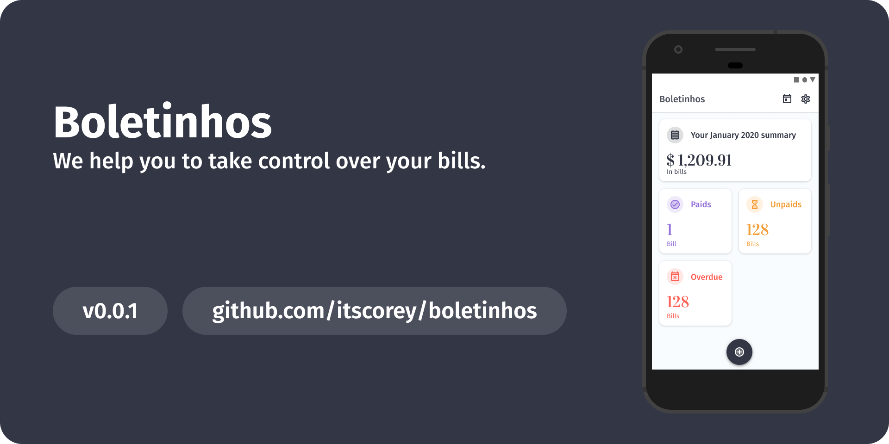

 
 

# Boletinhos
It's time to take control over your bills. Meet boletinhos.

## About
We are humans. It is a fact. There is another fact, at some point of our lives, we forget to pay some bill. We hate to pay bills. The day we pay them is the worse day of the month.

Then we meet Boletinhos. Of course the app isn't going to pay our bills, but at least it'll help us to remember to pay our bills and to organize our finances. This app rises with this goal: help us solve our problems and making our lives simple.

The app is stupidly simple and we do not aim to fight against good solutions like Mobills, GuiaBolso, Organizze and any other finances organizer solution. Our goal is to solve a very specific problem and we're going to work on it. 

> We'll **always** be a _free_ and _no-ad_ solution. We also don't have plans to add upgraded paid versions but feel free to fork this project and do whatever you want to do.

Boletinhos is also a playground project we aim to do a lot of experiments here using this codebase and it'll also be used in upcoming articles mainly for the Brazillian community because we lack of content.

## What awesome technologies are being used?

 - Kotlin
 - SimpleStack
 - Room (Android Arch Components)
 - Dagger 2
 - Androidx
 - Espresso
 - Junit 4
 - MocKk
 - AssertK
 - Robolectric
 - Material Design Language
 - LeakCanary
 - Detekt
 - Jacoco
 - Firebase Test Lab
 - GitHub Actions (CI)

**Disclaimer**: this project doesn't follow Google's recommended architecture. Feel free to fork the project and apply it or do whatever you want to. If you're expecting too see this project using Jetpack's ViewModel, LiveData, Navigation and Fragments, unfortunately we don't use it.

This project's architecture has been built on top of **SOLID** concepts and we also implement **MVVM** using pure reactive _ViewModels_ with _Kotlin Flow_.

Our UI layer is a **view-based** application being built on top of **SimpleStack** with **Single Activity Principle**. For more information, [check it out](https://github.com/Zhuinden/simple-stack/tree/master).

## Testing

Yes! We've tests! In each module (services module and UI module) you'll find unit testing and functional tests that matters!

## Build and Running

We don't have any external dependencies and you should be able to just build and run the project.

> If you want to fork the project and continue its development the way you prefer, we recommend you to setup Google Cloud Keys and Firebase project Id. The project's CI may not work properly without this config.

### Oh, wait... what?

Yes, we know. Boletinhos is an weird name. But is is funny for Brazillians, it means **Bills** but we call them **Boletinhos** because everytime we need to pay a bill we cry. It hurts deep in the heart and we need to make it funny so we don't cry. 👀 
